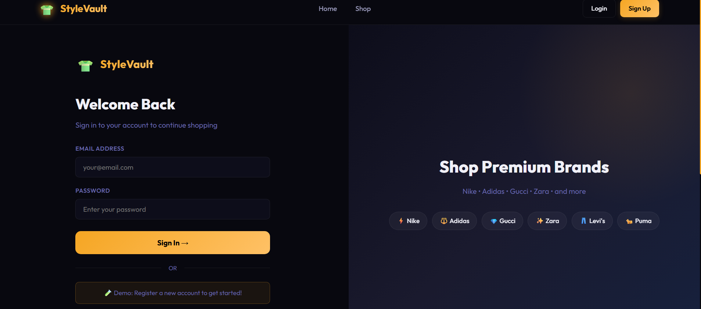
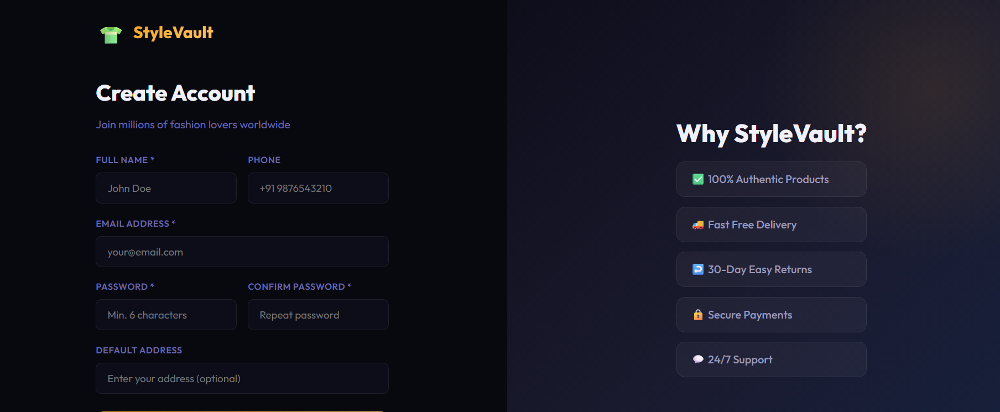
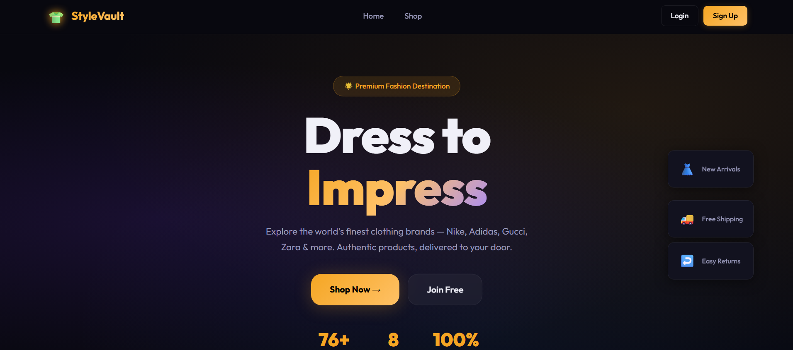
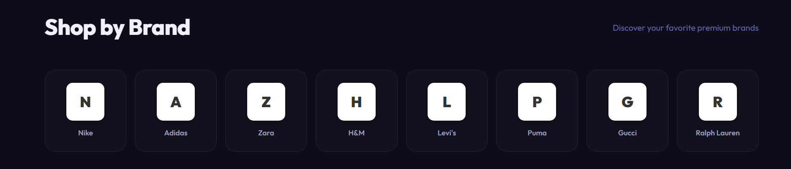

<div align="center">

# 👗 Style Vault

### Modern E-Commerce Platform for Fashion & Apparel

*A full-stack clothing storefront with a fast, responsive React UI and a secure, scalable Java backend.*

</div>

---


---

## 🛍️ About the Project

**Style Vault** is a full-stack e-commerce application built for modern fashion retail. It pairs a snappy, component-driven **React** frontend with a robust **Java (Spring Boot)** backend to deliver product browsing, cart management, secure checkout, and order tracking — all wrapped in a clean, mobile-first UI.

Whether you're a shopper browsing the latest drops or an admin managing inventory, Style Vault is designed to be fast, secure, and easy to extend.

---

## ✨ Features

### 🛒 Customer Experience
- Browse products by category, size, color, and price
- Smart search with filters and sorting
- Product detail pages with image galleries and size guides
- Persistent shopping cart and wishlist
- Secure checkout with order summary
- Order history and real-time order tracking
- User authentication (JWT-based) and profile management
- Responsive design — optimized for mobile, tablet, and desktop

### 🛠️ Admin Panel
- Product CRUD (create, read, update, delete)
- Inventory and stock management
- Order management dashboard
- Sales analytics overview
- Role-based access control (Admin / Customer)

### ⚙️ Engineering Highlights
- RESTful API design (controller → service → repository)
- JWT authentication & Spring Security
- Pagination, filtering, and sorting on all list endpoints
- Centralized error handling
- Dockerized for easy deployment
- CI-ready test suites (JUnit + React Testing Library)

---

## 🧰 Tech Stack

| Layer | Technology |
|---|---|
| **Frontend** | React, React Router, Redux Toolkit / Context API, Axios, Tailwind CSS |
| **Backend** | Java 17+, Spring Boot, Spring Security, Spring Data JPA |
| **Database** | MySQL / PostgreSQL |
| **Authentication** | JWT (JSON Web Tokens) |
| **Build Tools** | Maven (backend), npm/Vite (frontend) |


---

## 🏗️ Architecture

```
┌─────────────────┐         REST API (JSON)        ┌──────────────────┐
│   React Client   │ <─────────────────────────────> │  Spring Boot API │
│  (Vite / CRA)     │          HTTPS / JWT            │   (Java 17+)     │
└─────────────────┘                                  └──────────────────┘
                                                                │
                                                                ▼
                                                       ┌──────────────────┐
                                                       │   MySQL / Postgres │
                                                       └──────────────────┘
```

- **Frontend** consumes the REST API (`/api/...`) via Axios
- **Backend** exposes controllers → services → repositories (layered architecture)
- **Auth** uses stateless JWT tokens validated by a Spring Security filter chain
- **Database** access via Spring Data JPA / Hibernate

---

## 🚀 Getting Started

### Prerequisites

Make sure you have the following installed:

- [Node.js](https://nodejs.org/) (v18+) and npm/yarn
- [Java JDK](https://adoptium.net/) (17+)
- [Maven](https://maven.apache.org/) (3.8+)
- [MySQL](https://dev.mysql.com/) or [PostgreSQL](https://www.postgresql.org/) (or use Docker)
- Git
### Installation

Clone the repository:

```bash
git clone https://github.com/your-username/project-java.git
cd project-java
```

#### 1. Backend Setup

```bash
cd backend
mvn clean install
```

#### 2. Frontend Setup

```bash
cd frontend
npm install
```

### Environment Variables

**Backend** — create `backend/src/main/resources/application.properties`:

```properties
# Server
server.port=8080

# Database
spring.datasource.url=jdbc:mysql://localhost:3306/ecommerce_db
spring.datasource.username=root
spring.datasource.password=yourpassword
spring.jpa.hibernate.ddl-auto=update

# Seed data (loads data.sql on startup)
spring.sql.init.mode=always

# JWT
jwt.secret=your-256-bit-secret-key
jwt.expiration-ms=86400000

# CORS
app.cors.allowed-origins=http://localhost:3000
```

**Frontend** — create `frontend/.env`:

```env
VITE_API_BASE_URL=http://localhost:8080/api
VITE_STRIPE_PUBLIC_KEY=pk_test_xxxxxxxxxxxx
```

### Running the App

#### Option A — Run manually

**Backend:**
```bash
cd backend
mvn spring-boot:run
```
This boots `EcommerceApplication.java` and runs at `http://localhost:8080`. On first run, `data.sql` seeds the database with initial data.

**Frontend:**
```bash
cd frontend
npm run dev
```
Frontend runs at `http://localhost:3000`


---

## 📁 Project Structure

```
project-java/
├── backend/
│   ├── src/main/java/com/ecommerce/
│   │   ├── config/                    # App & Spring configuration
│   │   ├── controller/
│   │   │   ├── AuthController.java
│   │   │   ├── CartController.java
│   │   │   ├── OrderController.java
│   │   │   └── ProductController.java
│   │   ├── dto/
│   │   │   ├── AddToCartRequest.java
│   │   │   ├── AuthResponse.java
│   │   │   ├── LoginRequest.java
│   │   │   ├── PlaceOrderRequest.java
│   │   │   └── RegisterRequest.java
│   │   ├── model/
│   │   │   ├── CartItem.java
│   │   │   ├── Order.java
│   │   │   ├── OrderItem.java
│   │   │   ├── Product.java
│   │   │   └── User.java
│   │   ├── repository/                # Spring Data JPA repositories
│   │   ├── security/
│   │   │   ├── JwtFilter.java
│   │   │   └── JwtUtil.java
│   │   ├── service/
│   │   │   ├── AuthService.java
│   │   │   ├── CartService.java
│   │   │   ├── OrderService.java
│   │   │   └── ProductService.java
│   │   └── EcommerceApplication.java  # Main entry point
│   ├── src/main/resources/
│   │   ├── application.properties
│   │   └── data.sql                   # Seed data
│   ├── target/                        # Maven build output
│   └── pom.xml
│
├── frontend/
│   ├── src/
│   │   ├── components/                # Reusable UI components
│   │   ├── pages/                     # Route-level pages
│   │   ├── hooks/                     # Custom React hooks
│   │   ├── store/                     # Redux slices / context
│   │   ├── services/                  # Axios API calls
│   │   ├── utils/                     # Helper functions
│   │   └── assets/                    # Images, fonts, icons
│   ├── package.json
│   └── vite.config.js
│
├── docker-compose.yml
└── README.md
```

---

## 📸 Screenshots

### Login Page



### Signup Page



### Home Page




### Sho By Brand 


## 📚 API Documentation

Base URL: `http://localhost:8080/api`

### AuthController
| Method | Endpoint | Description | Request Body (DTO) | Auth Required |
|---|---|---|---|---|
| `POST` | `/api/auth/register` | Register a new user | `RegisterRequest` | No |
| `POST` | `/api/auth/login` | Login and receive JWT | `LoginRequest` → `AuthResponse` | No |

### ProductController
| Method | Endpoint | Description | Auth Required |
|---|---|---|---|
| `GET` | `/api/products` | Get all products | No |
| `GET` | `/api/products/{id}` | Get product details | No |
| `POST` | `/api/products` | Create a product | Admin |
| `PUT` | `/api/products/{id}` | Update a product | Admin |
| `DELETE` | `/api/products/{id}` | Delete a product | Admin |

### CartController
| Method | Endpoint | Description | Request Body (DTO) | Auth Required |
|---|---|---|---|---|
| `GET` | `/api/cart` | Get current user's cart (`CartItem[]`) | — | Yes |
| `POST` | `/api/cart/add` | Add item to cart | `AddToCartRequest` | Yes |
| `DELETE` | `/api/cart/{itemId}` | Remove item from cart | — | Yes |

### OrderController
| Method | Endpoint | Description | Request Body (DTO) | Auth Required |
|---|---|---|---|---|
| `POST` | `/api/orders` | Place a new order (`Order` + `OrderItem[]`) | `PlaceOrderRequest` | Yes |
| `GET` | `/api/orders/{id}` | Get order details | — | Yes |
| `GET` | `/api/orders/history` | Get order history for current user | — | Yes |

> 🔐 Protected routes are secured via `JwtFilter` + `JwtUtil` (see `security/`), which validates the `Authorization: Bearer <token>` header on each request.

> 💡 If `springdoc-openapi` is added as a dependency, interactive Swagger docs will be available at `http://localhost:8080/swagger-ui.html`.

---

## 🧪 Testing

**Backend:**
```bash
cd backend
mvn test
```

**Frontend:**
```bash
cd frontend
npm run test
```

---

## 📦 Deployment

- **Frontend:** Build with `npm run build` and deploy the `dist/` folder to Vercel, Netlify, or any static host.
- **Backend:** Package with `mvn clean package` to produce a runnable JAR, then deploy to AWS, Render, Railway, or any Java-compatible host.
- **Docker:** Use the provided `docker-compose.yml` for a one-command production-like deployment.

```bash
mvn clean package
java -jar target/ecommerce-0.0.1-SNAPSHOT.jar
```

---

## 🗺️ Roadmap

- [ ] Wishlist sync across devices
- [ ] Product reviews & ratings
- [ ] AI-powered outfit recommendations
- [ ] Multi-currency support
- [ ] Email notifications (order confirmation, shipping updates)
- [ ] Admin analytics dashboard with charts

See [open issues](../../issues) for a full list of proposed features.

---

## 🤝 Contributing

Contributions make the open-source community amazing. Any contributions are **greatly appreciated**.

1. Fork the project
2. Create your feature branch (`git checkout -b feature/AmazingFeature`)
3. Commit your changes (`git commit -m 'Add some AmazingFeature'`)
4. Push to the branch (`git push origin feature/AmazingFeature`)
5. Open a Pull Request

Please make sure to update tests as appropriate.

---

## 📄 License

Distributed under the MIT License. See [`LICENSE`](LICENSE) for more information.

---


